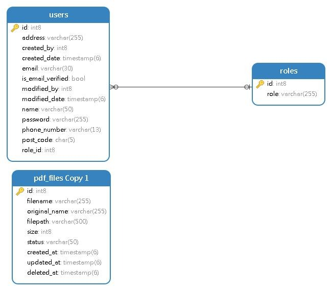

# PDF Management System - Technical Test

Backend REST API untuk sistem manajemen file PDF dengan fitur generate report, upload, dan manajemen file menggunakan Golang, PostgreSQL, dan JWT Authentication.

## Deskripsi Project

Aplikasi ini adalah backend service yang dibangun sebagai bagian dari Technical Test Backend Developer. Sistem ini memungkinkan pengguna untuk melakukan registrasi, login, dan mengelola file PDF (Generate, Upload, List, Delete) dengan otentikasi berbasis JWT Token.

## Tech Stack

*   **Bahasa Pemrograman**: Golang (Go 1.23+)
*   **Database**: PostgreSQL
*   **Authentication**: JSON Web Token (JWT) + BCrypt (Password Hashing)
*   **Libraries**:
    *   `github.com/lib/pq`: Driver PostgreSQL
    *   `github.com/jung-kurt/gofpdf`: Library untuk membuat file PDF
    *   `github.com/joho/godotenv`: Load environment variables
    *   `github.com/golang-jwt/jwt/v5`: Generate & Validate JWT
    *   `golang.org/x/crypto/bcrypt`: Enkripsi Password

## Struktur Folder Project

```
pdf-management-system/
├── cmd/
│   └── server/          # Entry point aplikasi (main.go)
├── internal/
│   ├── config/          # Koneksi database
│   ├── handler/         # HTTP Handler (Controller)
│   ├── middleware/      # Auth Middleware (JWT Check)
│   ├── model/           # Struct/Model Data
│   ├── repository/      # Logic akses database (Query)
│   └── service/         # Business Logic
├── uploads/
│   └── pdf/             # Folder penyimpanan file PDF fisik
├── schema.sql           # Skema Database SQL
├── postman_collection.json # Dokumentasi API Postman
├── .env.example         # Contoh konfigurasi environment
├── go.mod               # Dependency manager
└── README.md            # Dokumentasi Project ini
```

## Cara Instalasi dan Menjalankan Project

### Prasyarat
1.  **Go** sudah terinstall.
2.  **PostgreSQL** sudah berjalan.

### Langkah-langkah
1.  **Clone Repository**
    ```bash
    git clone <repository_url>
    cd pdf-management-system
    ```

2.  **Konfigurasi Database**
    Buat database baru di PostgreSQL dengan nama `pdf_management` (atau sesuaikan di .env).

3.  **Setup Environment Variables**
    Salin file `.env.example` menjadi `.env` dan sesuaikan kredensial database Anda.
    ```bash
    cp .env.example .env
    ```
    Isi `.env`:
    ```env
    DB_HOST=localhost
    DB_PORT=5432
    DB_USER=postgres
    DB_PASSWORD=password_anda
    DB_NAME=pdf_management
    JWT_SECRET=rahasia_super_aman
    PORT=8080
    ```

4.  **Install Dependencies**
    ```bash
    go mod tidy
    ```

5.  **Jalankan Aplikasi**
    ```bash
    go run cmd/server/main.go
    ```
    Server akan berjalan di `http://localhost:8080`.
    *Table database `users`, `roles`, dan `pdf_files` akan dibuat otomatis saat pertama kali dijalankan.*

---

## Dokumentasi API

### 1. Authentication

#### Register User
Mendaftarkan pengguna baru dengan role tertentu (Misal: Project Manager, Financial, HRD).
*   **Endpoint**: `POST /api/auth/register`
*   **Header**: `Content-Type: application/json`
*   **Body Request**:
    ```json
    {
      "name": "Budi Santoso",
      "email": "budi@example.com",
      "password": "password123",
      "address": "Jl. Merdeka No. 10",
      "phone_number": "08123456789",
      "post_code": "12345",
      "role_id": 1
    }
    ```
*   **Response Success (200)**:
    ```json
    {
      "success": true,
      "message": "User registered successfully",
      "data": { "id": 1, "name": "Budi Santoso", ... }
    }
    ```

#### Login
Masuk untuk mendapatkan JWT Token yang digunakan untuk akses endpoint selanjutnya.
*   **Endpoint**: `POST /api/auth/login`
*   **Body Request**:
    ```json
    {
      "email": "budi@example.com",
      "password": "password123"
    }
    ```
*   **Response Success (200)**:
    ```json
    {
      "success": true,
      "message": "Login successful",
      "data": {
        "token": "eyJhbGciOiJIUzI1Ni...",
        "user": { ... }
      }
    }
    ```

### 2. PDF Management (Requires Auth)
Semua endpoint di bawah ini **WAJIB** menyertakan Header:
`Authorization: Bearer <TOKEN_JWT_DARI_LOGIN>`

#### Generate Report PDF
Membuat file PDF laporan secara otomatis.
*   **Endpoint**: `POST /api/pdf/generate`
*   **Body Request**:
    ```json
    {
      "title": "Laporan Keuangan Q1",
      "institution_name": "PT Maju Mundur",
      "address": "Jl. Sudirman Kav 50, Jakarta",
      "phone": "(021) 555-7777",
      "logo_url": "https://via.placeholder.com/150",
      "content": "Berikut adalah laporan keuangan..."
    }
    ```
*   **Response Success (200)**:
    ```json
    {
      "success": true,
      "message": "PDF generated successfully",
      "data": {
        "id": 1,
        "filename": "report_20260128_....pdf",
        "status": "CREATED",
        ...
      }
    }
    ```

#### Upload PDF
Mengupload file PDF fisik ke server.
*   **Endpoint**: `POST /api/pdf/upload`
*   **Content-Type**: `multipart/form-data`
*   **Validasi**: File harus berformat `.pdf` dan ukuran maks 10MB.
*   **Body (Form Data)**:
    *   Key: `file`, Value: `(File PDF)`
*   **Response Success (200)**:
    ```json
    {
      "success": true,
      "message": "PDF uploaded successfully",
      "data": {
        "id": 2,
        "filename": "upload_....pdf",
        "status": "UPLOADED",
        ...
      }
    }
    ```

#### List PDF Files
Melihat daftar file PDF dengan filter dan pagination.
*   **Endpoint**: `GET /api/pdf/list`
*   **Query Parameters (Opsional)**:
    *   `page`: Halaman ke berapa (default: 1)
    *   `limit`: Jumlah data per halaman (default: 10)
    *   `status`: Filter status (`CREATED`, `UPLOADED`, `DELETED`)
*   **Response Success (200)**:
    ```json
    {
      "success": true,
      "data": [ ... ],
      "pagination": { "page": 1, "limit": 10, "total": 5 }
    }
    ```

#### Delete PDF
Menghapus file secara soft-delete (status menjadi DELETED).
*   **Endpoint**: `DELETE /api/pdf/{id}`
*   **Response Success (200)**:
    ```json
    {
      "success": true,
      "message": "PDF deleted successfully",
      "data": { "id": 1, "status": "DELETED", ... }
    }
    ```

---

## Database Schema (Ringkasan)



**Tabel `roles`**
*   `id` (PK)
*   `role` (VARCHAR) - *Isi: Project Manager, Financial, HRD*

**Tabel `users`**
*   `id` (PK)
*   `name`, `email` (Unique), `password` (Hashed)
*   `role_id` (FK -> roles.id)
*   ... (Field lengkap lihat schema.sql)

**Tabel `pdf_files`**
*   `id` (PK)
*   `filename`, `filepath`, `status` (Enum: CREATED/UPLOADED/DELETED)
*   `created_at`, `deleted_at`, `size`

---

**Link Repository**:https://github.com/sourchib/PDF-Management-System
**Author**: Muchammad Muchib Zainul Fikry
**Tanggal Tes**: 28 Januari 2026
